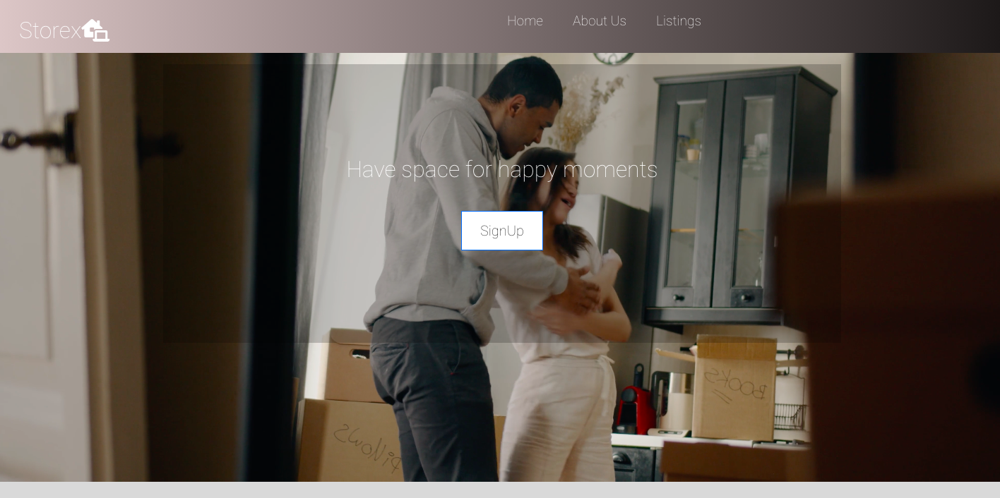

# :houses: StoreX
<!-- Badges -->
 
 
 
 

## Welcome to StorX, the app to find your perfect storage solution

##### :globe_with_meridians: Deployed App: [live]    (https://storexapp.herokuapp.com/) on heroku

### Description

 StoreX is a community oriented platform to simplify your life. We will connect you with the perfect host that will make sure your belongings are cared for and well kept.

 

 You can choose your host based on your preferences (i.e. location, lighting, temperature, etc.) Whether you’re an art collector, a wine connoisseur, or just our eclectic collector, we will match your treasures to “a home away from home”. 

 Host View: add a description of your available space for rent

 

 Your precious mementos will be safely stored away so you will have space for happy moments

 ### Technology

 We built the app using Javascript and React. We built out authentication using protected routes so users are required to sign in or log in to view certain pages. 

 We connected to third party APIS-
 Datapicker for date selection 
 and 
 Cloudinary for image upload

